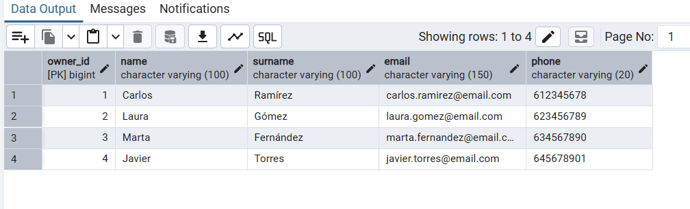
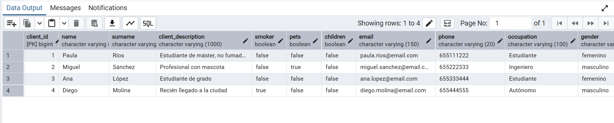

Queries SQL - plataforma de alquiler

NIVEL I

Parte 1. CREATE

0. Crea las tablas de tu modelo de datos

CREATE TABLE "owner" (
    owner_id     BIGSERIAL PRIMARY KEY,
    "name"       VARCHAR(100) NOT NULL,
    surname      VARCHAR(100)NOT NULL,
    email        VARCHAR(150) UNIQUE,
    phone    VARCHAR(20)
);

CREATE TABLE city (
    city_id     BIGSERIAL PRIMARY KEY,
    proximity_university       VARCHAR(100),
    neihborhood      VARCHAR(100)
);

CREATE TABLE property (
    property_id     BIGSERIAL PRIMARY KEY,
    owner_id        INT NOT NULL REFERENCES "owner"(owner_id),
    city_id         INT NOT NULL REFERENCES city(city_id),
    "name"            VARCHAR(100) NOT NULL,
    status          VARCHAR(20) NOT NULL,
    description     VARCHAR(1000),
    square_meters   NUMERIC(6,2),
    property_type   VARCHAR(50),
    smokers         BOOLEAN DEFAULT FALSE,
    pets            BOOLEAN DEFAULT FALSE,
    gender          VARCHAR(20),
    cadastre        VARCHAR(50) UNIQUE,
    price           NUMERIC(7,2) NOT NULL,
    publish_date    DATE DEFAULT CURRENT_DATE
);

CREATE TABLE room (
    room_id         BIGSERIAL PRIMARY KEY,
    property_id     INT NOT NULL REFERENCES property(property_id),
    "name"            VARCHAR(100) NOT NULL,
    description     VARCHAR(1000),
    status          VARCHAR(20) NOT NULL,
    price           NUMERIC(7,2) NOT NULL,
    publish_date    DATE DEFAULT CURRENT_DATE
);

CREATE TABLE client (
    client_id             BIGSERIAL PRIMARY KEY,
    "name"                  VARCHAR(100) NOT NULL,
    surname               VARCHAR(100),
    client_description    VARCHAR(1000),
    smoker                BOOLEAN DEFAULT FALSE,
    pets                  BOOLEAN DEFAULT FALSE,
    children              BOOLEAN DEFAULT FALSE,
    email                 VARCHAR(150) UNIQUE,
    phone                 VARCHAR(20),
    occupation            VARCHAR(100),
    gender                VARCHAR(20)
);
 
CREATE TABLE reservation (
    reservation_id   BIGSERIAL PRIMARY KEY,
    client_id        INT NOT NULL REFERENCES client(client_id),
    property_id      INT NOT NULL REFERENCES property(property_id),
    room_id          INT REFERENCES room(room_id),
    status           VARCHAR(20) NOT NULL,
    start_date       DATE NOT NULL,
    end_date         DATE,
    CHECK (end_date IS NULL OR end_date >= start_date)
);
 
CREATE TABLE facilities (
    facilities_id     BIGSERIAL PRIMARY KEY,
    property_id       INT REFERENCES property(property_id),
    room_id           INT REFERENCES room(room_id),
    bathroom          BOOLEAN DEFAULT FALSE,
    number_bathroom   INT,
    air_conditioning  BOOLEAN DEFAULT FALSE,
    heating           BOOLEAN DEFAULT FALSE,
    terrace           BOOLEAN DEFAULT FALSE,
    type_cousine      VARCHAR(50),
    lighting          VARCHAR(50),
    orientation       VARCHAR(50),
    pool              BOOLEAN DEFAULT FALSE,
    environment       VARCHAR(50),
    garage            BOOLEAN DEFAULT FALSE
);
 
CREATE TABLE chat (
    chat_id      BIGSERIAL PRIMARY KEY,
    owner_id     INT NOT NULL REFERENCES owner(owner_id),
    client_id    INT NOT NULL REFERENCES client(client_id),
    message      VARCHAR(500)
);
 
CREATE TABLE review (
    review_id      BIGSERIAL PRIMARY KEY,
    property_id    INT NOT NULL REFERENCES property(property_id),
    client_id      INT NOT NULL REFERENCES client(client_id),
    review_text    VARCHAR(500),
    punctuation    NUMERIC(2,1)
);
 
CREATE TABLE images (
    images_id     BIGSERIAL PRIMARY KEY,
    property_id   INT REFERENCES property(property_id),
    room_id       INT REFERENCES room(room_id),
    review_id     INT REFERENCES review(review_id),
    chat_id       INT REFERENCES chat(chat_id),
    "name"          VARCHAR(150),
    "path"          VARCHAR(255) NOT NULL,
    "type"          VARCHAR(20),
    "size"          INT
);
 
CREATE TABLE payment (
    payment_id       BIGSERIAL PRIMARY KEY,
    reservation_id   INT NOT NULL REFERENCES reservation(reservation_id),
    deposit          NUMERIC(7,2),
    amount           NUMERIC(7,2) NOT NULL
);

1. Inserta registros en las tablas creadas.

INSERT INTO "owner" ("name", surname, email, phone) VALUES
('Carlos', 'Ramírez', 'carlos.ramirez@email.com', '612345678'),
('Laura', 'Gómez', 'laura.gomez@email.com', '623456789'),
('Marta', 'Fernández', 'marta.fernandez@email.com', '634567890'),
('Javier', 'Torres', 'javier.torres@email.com', '645678901');

INSERT INTO city (proximity_university, neihborhood) VALUES
('Universidad Complutense', 'Moncloa'),
('Universidad de Sevilla', 'Nervión'),
('Universidad de Valencia', 'Benimaclet');

INSERT INTO property (owner_id, city_id, "name", status, description, square_meters, property_type, smokers, pets, gender, cadastre, price, publish_date) VALUES
(1, 1, 'Piso Centro', 'alquilada', 'Piso luminoso con habitación disponible', 80.00, 'piso', FALSE, TRUE, NULL, 'CAD001', 750.00, '2026-01-05'),
(1, 2, 'Ático Playa', 'libre', 'Ático con vistas al mar', 65.00, 'ático', FALSE, FALSE, NULL, 'CAD002', 950.00, '2026-02-10'),
(2, 1, 'Casa Estudiantes', 'alquilada', 'Casa compartida para estudiantes, varias habitaciones', 110.00, 'casa', FALSE, TRUE, NULL, 'CAD003', 600.00, '2025-11-20'),
(3, 3, 'Apartamento Universitario', 'reservada', 'Apartamento pequeño cerca de la universidad', 45.00, 'piso', TRUE, FALSE, NULL, 'CAD004', 500.00, '2026-03-01');

INSERT INTO room (property_id, "name", description, status, price, publish_date) VALUES
(3, 'Habitación Norte', 'Habitación individual con escritorio', 'alquilada', 300.00, '2025-11-20'),
(3, 'Habitación Sur', 'Habitación doble con balcón', 'libre', 280.00, '2025-11-20'),
(3, 'Habitación Este', 'Habitación individual, baño compartido', 'libre', 290.00, '2025-11-20'),
(1, 'Habitación Invitados', 'Habitación libre dentro del Piso Centro', 'libre', 320.00, '2026-01-05');

INSERT INTO client ("name", surname, client_description, smoker, pets, children, email, phone, occupation, gender) VALUES
('Paula', 'Ríos', 'Estudiante de máster, no fumadora', FALSE, FALSE, FALSE, 'paula.rios@email.com', '655111222', 'Estudiante', 'femenino'),
('Miguel', 'Sánchez', 'Profesional con mascota', FALSE, TRUE, FALSE, 'miguel.sanchez@email.com', '655222333', 'Ingeniero', 'masculino'),
('Ana', 'López', 'Estudiante de grado', FALSE, FALSE, FALSE, 'ana.lopez@email.com', '655333444', 'Estudiante', 'femenino'),
('Diego', 'Molina', 'Recién llegado a la ciudad', TRUE, FALSE, FALSE, 'diego.molina@email.com', '655444555', 'Autónomo', 'masculino');

INSERT INTO reservation (client_id, property_id, room_id, status, start_date, end_date) VALUES
(1, 3, 1, 'confirmada', '2026-01-10', '2026-06-10'),
(2, 1, NULL, 'confirmada', '2026-02-01', NULL),
(3, 3, 2, 'pendiente', '2026-03-01', '2026-09-01'),
(1, 4, NULL, 'cancelada', '2025-12-01', '2025-12-15');

INSERT INTO facilities (property_id, room_id, bathroom, number_bathroom, air_conditioning, heating, terrace, type_cousine, lighting, orientation, pool, environment, garage) VALUES
(3, NULL, TRUE, 2, TRUE, TRUE, FALSE, 'americana', 'natural', 'sur', FALSE, 'tranquilo', FALSE),
(NULL, 1, TRUE, 1, TRUE, FALSE, FALSE, NULL, 'natural', 'este', FALSE, NULL, FALSE),
(NULL, 2, FALSE, NULL, FALSE, TRUE, TRUE, NULL, 'artificial', 'norte', FALSE, NULL, FALSE),
(1, NULL, TRUE, 2, TRUE, TRUE, TRUE, 'independiente', 'natural', 'sur', TRUE, 'exclusivo', TRUE);

INSERT INTO review (property_id, client_id, review_text, punctuation) VALUES
(3, 1, 'Muy buena experiencia, casa cómoda y bien comunicada.', 4.5),
(1, 2, 'Piso excelente, tal como se describía.', 5.0),
(3, 3, 'Correcto, aunque algo ruidoso por las noches.', 3.8);

INSERT INTO payment (reservation_id, deposit, amount) VALUES
(1, 300.00, 300.00),
(2, 750.00, 750.00),
(3, 280.00, 280.00),
(4, 500.00, 0.00);

INSERT INTO chat (owner_id, client_id, message) VALUES
(1, 1, 'Hola, ¿la habitación sigue disponible para marzo?'),
(2, 3, 'Sí, puedes venir a verla este fin de semana.'),
(1, 2, 'Perfecto, confirmamos el contrato para el día 1.');

INSERT INTO images (property_id, room_id, review_id, chat_id, "name", "path", "type", "size") VALUES
(1, NULL, NULL, NULL, 'fachada_piso_centro', '/img/property1_fachada.jpg', 'jpg', 204800),
(NULL, 1, NULL, NULL, 'habitacion_norte', '/img/room1_norte.jpg', 'jpg', 153600),
(NULL, NULL, 1, NULL, 'foto_review_casa', '/img/review1_casa.jpg', 'jpg', 102400),
(NULL, NULL, NULL, 3, 'captura_contrato', '/img/chat3_contrato.png', 'png', 51200);

Parte 2. READ

2. Mostrar todos los registros de la tabla `anfitriones`.

```sql
SELECT * FROM "owner";
```
**Resultado:**



3. Mostrar todos los registros de la tabla `huespedes`.

```sql
SELECT * FROM client;
```

**Resultado:**


